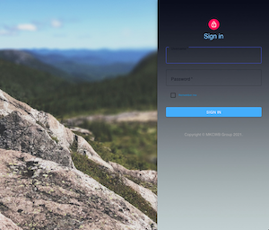
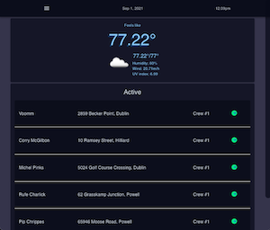
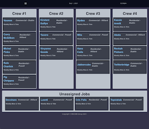
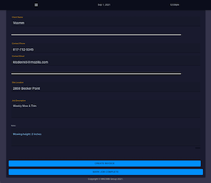
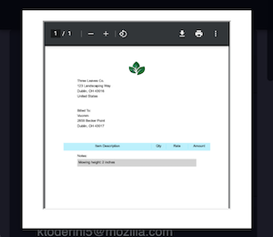

<!--
Job Details Page:
(Admin)
  - Switch to be able to edit, starts at employee view-only
  - Clock in, Clock Out, Complete
  - Services + Products sold/completed/used

MODELS:
  - jobs [done/inprogress] - needs refactored: divide info b/w job and customer models
      *add site info (site address, site contact, site phone, site email)
  - users [done/inprogress]
  - customers [TODO: id, cust name, company name, cust address, work phone, home phone, email, payment info(?)]

PAGES:
  - login
    - admin dashboard
        **weather - date and time
      - job assignment page (when job is clicked - able to edit)
        **functionality:
          *create jobs
          *edit jobs
          *approve as complete

    - employee dashboard
        **weather - date and time
      - specific job page when component is clicked - able to edit)
        **functionality:
          *clock in/out
          *check tasks off list
          *add tasks/make notes
          *fill out invoice + mark as complete/{send admin notication}
    - job detail
      - client name
      - full address
      - full job description
      - start date
      - est goal end date
      - edit button
      - assigned crew
      - notes
      - button to mark as complete
      - ** ADMIN: button to approve job complete + generate invoice

TODO:
- where to put invoice form
- authentication
- create components
  -
  -
- connect components + render in App
- working links in popout menu
- put button for edit job on job details page + render edit details for that specific job

TODO / FIX:
- fix authentication functionality
- edit job page - render information already stored in job page if there is any + make editable
- PWA functionality

CURRENT ASSIGNMENTS:

- Will:
*Password Auth - using passport npm package[done]
  - auth util:
    - declare logged in user sessionid/user is + type (admin or employee)

- Corrine:
  * emp and admin dash with if/else functionality
    - import to evey page
    - implement turnary operator / if else to the dashboard
    - mini components for emp dash vs employee dash
  * fix open drawer
  * styling

- Kathryn:
  * job detail page
  * put address + button in jobs list - link to job details page
  * job assignment page
  * weather and time
  * employee dashboard

- Brandon:
  * react router [done]
  * seed data [done]
  * database seeded [done]
  * PWA functionality

- Michael:
  * database up and running [done]
  * invoice - employee fill out and pdf download [by tues]

- Later:
  - define company we're making this for
  - create an acct functionality
  - images and styling
  - offline functionality [Brandon]
  - new title of proj
  - weather and time of day

- FINAL PRESENTATION:
  - login as admin
  - create job
  - assign job
  - logout
  - login as employee
  - complete job
  - fill out invoice
  - send to admin
  - logout employee
  - login admin
  - approve completed job
  - download completed invoice as pdf + send out to client
  *** PWA

-->

# Custom Workforce Manager
## Progressive Web Application (Mobile/Tablet First)

## Table of Contents

- [User Story](#user-story)
- [Technology](#technology)
- [Visuals](#visuals)
- [Future Development](#future-development)
- [Links](#links)
- [Contribute](#contribute)
- [Contact Me](#questions)
- [License](#license)

### User Story

    AS AN ADMINISTRATOR
    I WANT to be able to
    - create invoices, that employees can easily fill out
    - receive job information and create jobs
    - assign jobs to employees
    - monitor employee Job progress
    SO THAT I can efficently operate and manage my small / medium sized business's fleet employees.

    AS AN EMPLOYEE
    I WANT to be able to
    - view assigned jobs for the day
    - access jobsite information (i.e. address, contact information, notes, etc)
    - complete related jobsite forms/invoices
    - mark jobs completed
    - have the ability to continue to work while remote and offline
    SO THAT I can continue to complete my job expectations in an easy and organized fashion.

### Technology Used (MERN Stack)

* MongoDb
* Express
* React (w/ hooks)
* Node.Js
* Passport.Js
* Sortable Js
* Moment
* react-material-ui

### Visuals

 
 

### Login Information:
* Admin Username: Crew #1 | Password: 4CfkVBoxV
* Employee Username: Crew #2 | Password: Ggjz4t1

### Future Development
#### PWA Functionalities (in progress)

* Available offline
* Downloadable to android + ios homescreen's
* Device camera functionality / implementation
* Fast load speeds
* Mobile app look/feel
* Push Notifications (mobile + desktop)

### Links

* Deployed Application: <https://custom-workforce-manager.herokuapp.com/>

### Contribute

Creators:
- Michael Kotte: <https://github.com/mkotte>
- Kathryn Wilkinson: <https://github.com/NAHco-code>
- William Nicholson: <https://github.com/will98nicholson>
- Brandon King: <https://github.com/thebsking>
- Corrinne Worden: <https://github.com/CorrinneW>

If you have something you'd like to contribute, make a pull request!

## Questions?

Please feel free to contact us with any questions via email.

- [michaelkotte1@gmail.com](michaelkotte1@gmail.com)
- [kathrynxwilk@gmail.com](kathrynxwilk@gmail.com)
- [will98nicholson@gmail.com](will98nicholson@gmail.com)
- [brandonscottking@gmail.com](brandonscottking@gmail.com)
- [corrinneworden@gmail.com](corrinneworden@gmail.com)

## License

This project is licensed under the Apache 2.0 License.
For more information, please visit: [Apache Explained](https://choosealicense.com/licenses/apache-2.0/)

&copy; 2021 m.kotte |k.wilkinson | w.nicholson | b.king | c.worden
